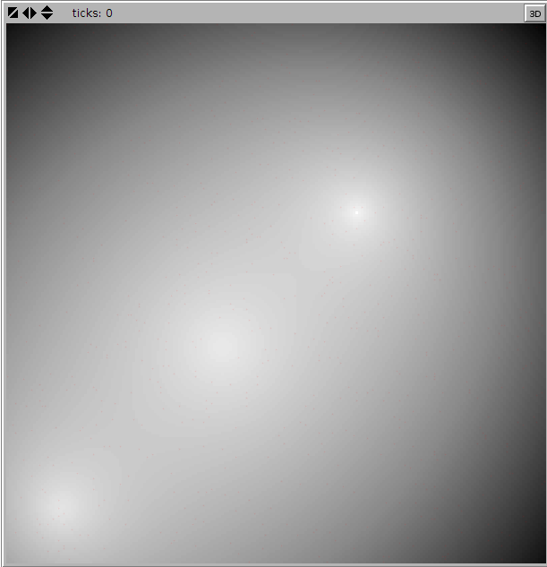

# NetLogo Landscapes Extension

This extension is a thin wrapper around the continuous function optimization problems classes implemented in the [Optimization Algorithm Toolkit (OAT)](http://optalgtoolkit.sourceforge.net/).

You can [download the Landscapes extension from here](https://github.com/NetLogo/Landscapes-Extension/releases). Just unzip the file under your NetLogo's `extensions` folder.

A continuous function optimization problem is one where you are are trying to find either the global optima or minima of a continuous function. [OAT](http://optalgtoolkit.sourceforge.net/) implements many such problems as Java classes. The goal of this extension is to make most of these problems easily usable from NetLogo.

You can think of these functions as describing different [fitness landscapes](http://en.wikipedia.org/wiki/Fitness_landscape), hence the name of the extension.

In the [demo folder](demo), you will find [landscapes.nlogo](demo/landscapes.nlogo), a very basic model that demonstrates the different landscapes that are available. The model is inspired by the [Hill climbing code example](http://modelingcommons.org/browse/one_model/2256#model_tabs_browse_info) from the NetLogo Models Library.

## Usage

#### `landscapes:generate` _problem-name_ _patch-variable-name_

What the extension does is take the problem function referred to by _problem-name_, make sure it is a maximization problem (by adding `* -1` to the minimization problems), map the problem domain to the NetLogo world size, normalize all the function values between 0.0 and 1.0, and assign the values to the patch variable named _patch-variable-name_. (The extension will give you an error message if the patch variable does not exist.)

Neither problem names nor variable names are case sensitive.

You can find out all the available problem names by using the [`landscapes:list`](#landscapeslist) primitive.

You will often want to color your patches according to the value of the variable that you used. This is easily done using [NetLogo's `scale-color` primitive](http://ccl.northwestern.edu/netlogo/docs/dictionary.html#scale-color).

Here is an example:

    extensions [ landscapes ]
    patches-own [ height ]

    to setup
      landscapes:generate "3 POT HOLES" "height"
      ask patches [ set pcolor scale-color grey height 0 1 ]
    end

will give you a view that looks like this (the whitest parts are the "peaks" of the landscape):

Note that, in general, the Landscapes extension works better with lots of patches. In the above example, both `max-pxcor` and `max-pycor` are set to `100`.

####`landscapes:list`

Reports a list of the available problem names.

For example,

    foreach landscapes:list print

will output:

    3 POT HOLES
    ACKLEY'S FUNCTION
    ACKLEY'S PATH FUNCTION 10
    AXIS PARALLEL HYPER-ELLIPSOID FUNCTION
    BOHACHEVSKY'S FUNCTION
    BRANINS'S RCOS FUNCTION
    CPF1
    CPF2
    DE JONG F1
    EASOM'S FUNCTION
    EUCLIDEAN
    EXP
    F3
    F4 (PSHUBERT1)
    F5 (PSHUBERT2)
    F6 (QUARTIC)
    F7 (SHUBERT FUNCTION)
    G3
    GENERALIZED GRIEWANK FUNCTION
    GENERALIZED HIMMELBLAU'S FUNCTION
    GENERALIZED PENALIZED FUNCTION 1
    GENERALIZED PENALIZED FUNCTION 2
    GENERALIZED RASTRIGIN'S FUNCTION
    GENERALIZED ROSENBROCK'S FUNCTION
    GENERALIZED SCHWEFELS PROBLEM 2.26
    GOLDSTEIN-PRICE'S FUNCTION
    GRIEWANGK'S FUNCTION 8
    HANSENS FUNCTION
    HORN'S FMMEASY
    HORNS 5 PEAKS (MODIFIED)
    LANGERMANN'S FUNCTION 11 (M=4)
    LANGERMANN'S FUNCTION 11 (M=7)
    M5 (HIMMELBLAU'S FUNCTION)
    M6 (SHEKEL'S FOXHOLES)
    MICHALEWICZ'S FUNCTION 12
    MOVED AXIS PARALLEL HYPER-ELLIPSOID FUNCTION
    MULTI FUNCTION
    PEAKS
    QUARTIC FUNCTION (NOISE)
    RASTRIGIN'S FUNCTION 6
    RIPPLES
    ROOTS
    ROSENBROCK'S VALLEY (DE JONG F2)
    ROTATED HYPER-ELLIPSOID FUNCTION
    SCHAFFER'S FUNCTION
    SCHWEFEL'S FUNCTION 7
    SCHWEFEL'S PROBLEM 1.2
    SCHWEFEL'S PROBLEM 2.21
    SCHWEFEL'S PROBLEM 2.22
    SHUBERT FUNCTION
    SIX-HUMP CAMEL BACK FUNCTION
    SPHERE
    SQUASHED FROG FUNCTION (TIMBO)
    STEP FUNCTION
    SUM OF DIFFERENT POWER FUNCTION
    TEST FUNCTION F1
    TEST FUNCTION F2 (ROSENBROCK'S FUNCTION)
    TEST FUNCTION F3
    TEST FUNCTION F4 (QUARTIC FUNCTION)
    TEST FUNCTION F5 (SHEKEL'S FUNCTION)

We do not provide documentation for the various problems. Using the **cycle** button in [the extension's demo](demo/landscapes.nlogo) will at least show you what they look like. OAT itself has [a file that lists the references for some of these problems](http://optalgtoolkit.cvs.sourceforge.net/viewvc/optalgtoolkit/optalgtoolkit/src/problems.cfo.properties?revision=1.3&content-type=text%2Fplain). You can also [browse OAT's source code](http://optalgtoolkit.cvs.sourceforge.net/viewvc/optalgtoolkit/optalgtoolkit/src/com/oat/domains/cfo/problems/) to figure out what they do exactly.

## Building

Run `./sbt package` to build the extension.

If the build succeeds, `landscapes.jar` will be created.

## Credits

Authored by Nicolas Payette.

## Terms of Use

The NetLogo Landscapes extension is in the public domain. To the extent possible under law, Uri Wilensky has waived all copyright and related or neighboring rights.

[OAT](http://sourceforge.net/projects/optalgtoolkit/) is licensed under the [GNU Library or Lesser General Public License version 2.0 (LGPLv2)](http://www.gnu.org/licenses/old-licenses/lgpl-2.0.html).
